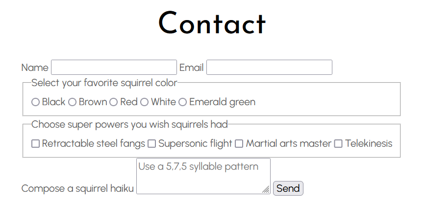
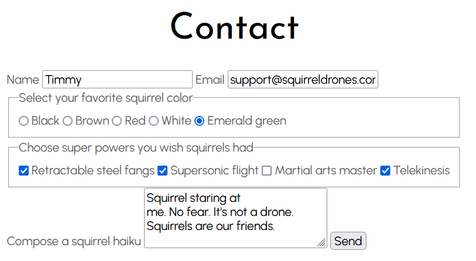
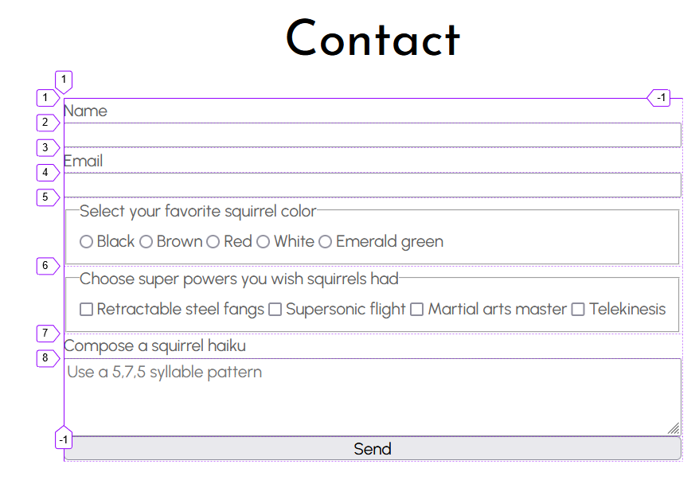
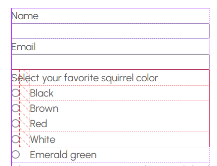
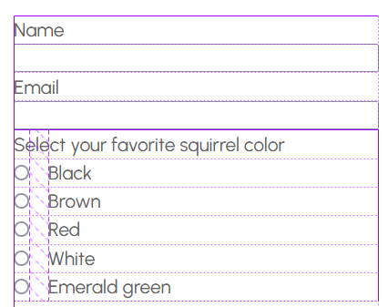
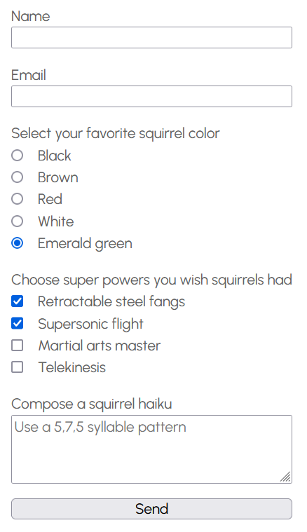
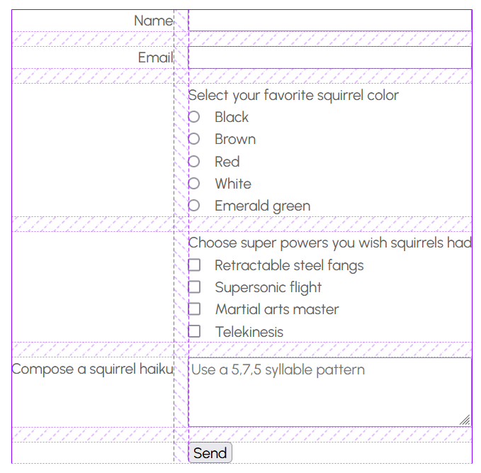
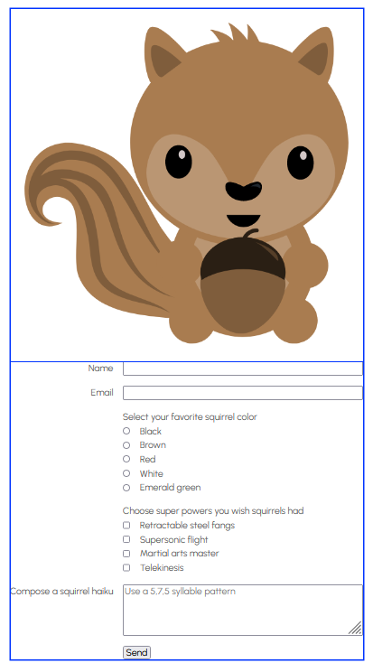
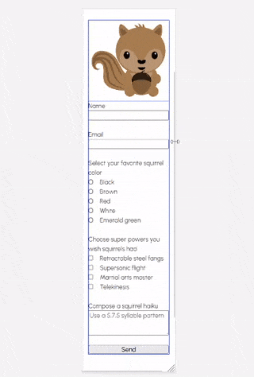
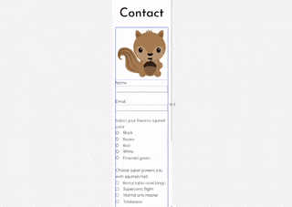

<!-- cSpell:enable  -->

# Grid + Form + Style – Part 1

**Objectives**: Create a responsive form using grid. Create custom styles that override the basic browser form styles. Add the form to a flexbox that also contains an SVG image.

**Concepts covered**: Grid, nested layouts with flexbox, form elements, accessibility and forms, GET query strings, media queries, working with SVGs in flexbox, display: contents, UI pseudo-classes.

In this assignment you will

- build a form following correct HTML principles, including HTML semantics, and accessability.
- use CSS grid to create two form layouts – a one-column layout for mobile, and a two-column layout for non-mobile.
- override the basic browser form styles and create custom styles for the form elements, including custom checkboxes and radio buttons.
- nest the grid inside a flexbox that also contains an SVG image; the flexbox will be responsive and switch from column to row layout at your mobile breakpoint.
- use media queries to make the layouts responsive

| :warning: This assignment builds on your _Responsive menu_ assignment                                                                                                                                                                                                                                                                                                                                                                               |
| :-------------------------------------------------------------------------------------------------------------------------------------------------------------------------------------------------------------------------------------------------------------------------------------------------------------------------------------------------------------------------------------------------------------------------------------------------- |
| After cloning this repo and opening it in VSCode, copy the following files and folders from your _Responsive menu_ assignment into this repo.<br><br><ul><li>📄 index.html</li><li>📄 favicon.ico</li><li>📁styles</li><li>📁images</li><li>📁about</li><li>📁contact</li></ul><br>**Make sure that you don't copy any other folders or files, including the `test` folder, the hidden `.git` and `.github` folders, and the `package.json` files** |

## The form

Before we use grid to layout the form, we need to create the form itself.

| :book: Read these resources before building your form                                                                                                                                                                                                                                                                                                                                                                                                                      |
| :------------------------------------------------------------------------------------------------------------------------------------------------------------------------------------------------------------------------------------------------------------------------------------------------------------------------------------------------------------------------------------------------------------------------------------------------------------------------- |
| <ul><li>[MDN: How to structure a web form](https://developer.mozilla.org/en-US/docs/Learn/Forms/How_to_structure_a_web_form)</li><li>[MDN: Basic native form controls](https://developer.mozilla.org/en-US/docs/Learn/Forms/Basic_native_form_controls)</li><li>[CSS-Tricks: HTML Inputs and Labels: A Love Story](https://css-tricks.com/html-inputs-and-labels-a-love-story/) – _be particularly mindful of the accessibility recommendations in this article_</li></ul> |

| :bookmark_tabs: Reference these pages while building your form                                                                                                                                                                                       |
| :--------------------------------------------------------------------------------------------------------------------------------------------------------------------------------------------------------------------------------------------------- |
| <ul><li>[MDN: list of available form elements](https://developer.mozilla.org/en-US/docs/Web/HTML/Element#forms)</li><li>[MDN: \<input\>: The Input (Form Input) element](https://developer.mozilla.org/en-US/docs/Web/HTML/Element/input) </li></ul> |

### Form elements

Let's add a [form element](https://developer.mozilla.org/en-US/docs/Web/HTML/Element/form) to your `contact/index.html` file, and then create an unstyled form that looks similar to this one:



The form above uses a [text input](https://developer.mozilla.org/en-US/docs/Web/HTML/Element/input/text), an [email input](https://developer.mozilla.org/en-US/docs/Web/HTML/Element/input/email), checkboxes, radio buttons, a textarea, and a submit button. All elements have explicit labels. The checkboxes and radio button use a fieldset and legend, following the [W3C Web Accessibility Initiative (WAI) recommendations](https://www.w3.org/WAI/tutorials/forms/grouping/#associating-related-controls-with-fieldset).

| :warning: Don't add any `<div>`, `<p>` or `<br>` elements to your form                                                                          |
| :---------------------------------------------------------------------------------------------------------------------------------------------- |
| Your unstyled form won't look great. Instead of relying on these elements for old-school form formatting, we will use grid to layout your form. |

#### Labels and required attributes

- You must include explicit labels for all your form elements.
- All labels must be associated with the correct form element using the label's `for` attribute.
- All form elements must have `name` and `id` attributes.
- `<input>` elements must have a `type` attribute.
- checkboxes and radio button elements must have a `value` attribute.
- your email field must have a `required` attribute.

Let's look at the HTML for the text and email form elements of the form above to see how to create an explicit label and to understand the difference between `type`, `id`, and `name` attributes. The attributes can be confusing as they often have the same value.

```html
<label for="name">Name</label>
<input type="text" id="name" name="name" />

<label for="email">Email</label>
<input type="email" id="email" name="email" required />
```

_Explicit labels_ are separate from the form element and do not nest the form element inside them like _implicit labels._ For non-radio and non-checkbox form elements, the label should appear before the form element.

The `for` attribute of the `<label>` links the label to its corresponding form element by matching the element's `id` attribute (remember that `id` attributes should be unique on the page).

The `type` attribute specifies the type of form control. [Here's a list of all \<input\> types](https://developer.mozilla.org/en-US/docs/Web/HTML/Element/input). The first input is `text`, the second is `email`. The `email` type is a text input that provides a basic validation check for email addresses. (The `required` attribute specifies that the email field is required – make sure to add that to your email input as it's part of the rubric requirements.)

The `name` attribute can be confusing to beginners as it's used for form processing. Technically, with our basic form, we don't need it, but you should understand its use.

If you click the submit button, your browser will perform a default GET action. It will append the form data to the URL in name/value pairs. It's intended for a program on the server to process the data.

For example, if I click `Send` on the form below



my browser will send a GET request to the URL `http://127.0.0.1:5500/contact/index.html` (The domain in the URL is my local computer using live server on port 5500.)

The browser will append the form data to the URL as a _query string_ with name/value pairs. The `?` indicates the start of the query string. The `&` separates the name/value pairs.

```
http://127.0.0.1:5500/contact/index.html?name=Timmy&email=support%40squirreldrones.com&color=green&power=fangs&power=flight&power=telekinesis&haiku=Squirrel+staring+at%0D%0Ame.+No+fear.+It%27s+not+a+drone.%0D%0ASquirrels+are+our+friends.
```

For the first name/value, you see `name=Timmy`. `name` is the name attribute from text input: `name="name"`. `Timmy` is the value the user entered in the form element. The `=` separates the name from the value.

The `email` name/value pair is `email=support%40squirreldrones.com`. The `@` is a special character. To include it in the URL, the browser encodes it as `%40`.

We'll refer back to this URL as we add more form elements.

#### Grouped form elements

| :bulb: Checkboxes vs. radio buttons                                                                                                                                                                                                                                                                                                                                                                                                     |
| :-------------------------------------------------------------------------------------------------------------------------------------------------------------------------------------------------------------------------------------------------------------------------------------------------------------------------------------------------------------------------------------------------------------------------------------- |
| [Checkbox inputs](https://developer.mozilla.org/en-US/docs/Web/HTML/Element/input/checkbox) and [radio button inputs](https://developer.mozilla.org/en-US/docs/Web/HTML/Element/input/radio) are built in a similar way. The difference between the two is that while you can select multiple checkboxes, you can select only one radio button. Checkboxes have a default square shape while radio buttons have a default circle shape. |

To let the browser know to group the inputs together, each input must have the same `name` attribute. If you notice that you can select all of your radio buttons, that's a clue that they don't all have the same `name` attribute.

Unlike text inputs, where the value in the query string name/value pair is what the user types in the textbox, if a checkbox or radio input does not have a `value` attribute, the browser will send `on` as the value. For example, if the user selects the "red" radio button, and it doesn't have a value attribute, the browser will send `color=on` as the name/value pair in the query string.

Review the following HTML and make sure you understand the purpose of each attribute. Notice, also, the labels for radio buttons (and checkboxes) appear after the form element.

```html
<fieldset>
  <legend>Select your favorite squirrel color</legend>

  <input type="radio" id="black" name="color" value="black" />
  <label for="black">Black</label>

  <input type="radio" id="brown" name="color" value="brown" />
  <label for="brown">Brown</label>

  <input type="radio" id="red" name="color" value="red" />
  <label for="red">Red</label>

  <input type="radio" id="white" name="color" value="white" />
  <label for="white">White</label>

  <input type="radio" id="green" name="color" value="green" />
  <label for="green">Emerald green</label>
</fieldset>
```

You likely noticed the `<fieldset>` and `<legend>` elements. They are recommended by the WAI for use with radio buttons and checkboxes for accessability purposes. The [`<fieldset>` element](https://developer.mozilla.org/en-US/docs/Web/HTML/Element/fieldset) alerts the user that the elements inside it are related. The [`<legend>` element](https://developer.mozilla.org/en-US/docs/Web/HTML/Element/legend) provides the caption for the group of related form elements. Make sure to include both in your form with your radio buttons and checkboxes.

Review the HTML for the radio buttons above and the HTML for the checkboxes below, and then see if you understand how the name/value pairs were created for the query string.

```
color=green&power=fangs&power=flight&power=telekinesis
```

```html
<fieldset>
  <legend>Choose super powers you wish squirrels had</legend>

  <input type="checkbox" id="fangs" name="power" value="fangs" />
  <label for="fangs">Retractable steel fangs</label>

  <input type="checkbox" id="flight" name="power" value="flight" />
  <label for="flight">Supersonic flight</label>

  <input type="checkbox" id="martial-arts" name="power" value="martial-arts" />
  <label for="martial-arts">Martial arts master</label>

  <input type="checkbox" id="telekinesis" name="power" value="telekinesis" />
  <label for="telekinesis">Telekinesis</label>
</fieldset>
```

#### Textarea

A [\<textarea\> element](https://developer.mozilla.org/en-US/docs/Web/HTML/Element/textarea) allows the user to enter multiple lines of text (including line breaks). Most browsers allow the user to drag the corner of the text area to change its size, but you can also specify the number of rows and columns you'd like with the `rows` and `cols` attributes, although these can be overridden by CSS.

Add a textarea to your form, and use a `placeholder` attribute to give the user an example of what to type. The `placeholder` attribute is not a value that will be sent in the query string. If you want default text to appear in the textarea, add it between the opening and closing textarea tags.

```html
<label for="haiku">Compose a squirrel haiku</label>
<textarea
  id="haiku"
  name="haiku"
  rows="3"
  placeholder="Use a 5,7,5 syllable pattern"></textarea>
```

If you look at the name/value pair for the textarea in the query string you will see

```
haiku=Squirrel+staring+at%0D%0Ame.+No+fear.+It%27s+not+a+drone.%0D%0ASquirrels+are+our+friends.
```

You can see the original text with some non-visible characters [percent-encoded](https://developer.mozilla.org/en-US/docs/Glossary/percent-encoding) The `%0D%0A` is the browser encoding the carriage return and line feed characters. The `+` characters are the browser encoding the spaces (although spaces in file names are encoded as `%20`). This is why reason why it's not a good idea to use spaces or unusual characters in your file names on the internet.

#### Submit button

We will finally add a [button](https://developer.mozilla.org/en-US/docs/Web/HTML/Element/button), although it won't do anything except generate the URL with the query string. You need a program to receive the query string and process it.

You may see two different buttons used in forms.

**OLD**

```html
<input type="submit" />
```

**NEW**

```html
<button>Submit</button>
```

is the newer, and preferred way to create a submit button. If a `<button>` is inside a `<form>`, its default type is `submit`, so you don't have to specify the type attribute. If you would also like a form reset button, you can add another button with ` type="reset"`.

Add the button with text to your form.

## Initial grid layout

If you haven't already, add a class to the contact page's body element, e.g. `<body class="contact">`. This will make it easier to override general layout styles in your `main.css`.

In your main CSS file, add the following styles:

```css
.contact form {
  display: grid;
}
```

In just one declaration, you've cleaned up the form layout a bit. This is a screenshot in Firefox with the overlay grid enabled.



Each direct child of form is a grid item. The default grid layout is a single column, so the form elements are stacked vertically. The `display: grid` declaration is a shorthand for

```html
display: grid; grid-template-columns: auto; grid-template-rows: auto;
```

The `auto` values tell the browser to automatically size the grid items to fit the content. Since the fieldset containing the checkboxes is the widest grid-item, it determines the grid's width (also remember your body is likely a flexbox with `align-items: center`) which will minimize the width of the grid.)

Since your radio buttons and checkboxes are in a fieldset, they are not part of the grid. Let's add a grid to the fieldset.

But first, lets remove the browser's default styles for the fieldset:

```css
.contact fieldset {
  border: none;
  padding: 0;
  margin: 0;
}
```

Then add a grid to the fieldset:

```css
.contact fieldset {
  display: grid;
  grid-template-columns: auto 1fr;
  grid-column-gap: 1rem;

  border: none;
  margin: 0;
  padding: 0;
}
```

The grid works, but if you look closely, the grid seems a bit off. That's because the spec for `<legend>` requires that it to be positioned at the top left of its containing `<fieldset>`, so it cannot be a grid-item.



For this assignment, it's ok to leave it as it is. But if you want to fix it, here's a trick that, as of fairly recently, should be WAI and A11Y compliant. To learn more, see Adrian Roselli's [Display: Contents Is Not a CSS Reset ](https://adrianroselli.com/2018/05/display-contents-is-not-a-css-reset.html).

You wrap the fieldset in a div and set the grid on the div.

```html
<div class="fieldset-wrapper">
  <fieldset>
    <legend>Select your favorite squirrel color</legend>

    <input type="radio" id="black" name="color" value="black" />
    <label for="black">Black</label>

    ...
  </fieldset>
</div>
```

```css
.contact .fieldset-wrapper {
  display: grid;
  grid-template-columns: auto 1fr;
  grid-column-gap: 1rem;
}
```

Next, use `display: contents` to removing the `<fieldset>` element's containing box, which will allow the legend, along with the inputs and labels to be positioned in the wrapper div's grid. Since our grid has two columns, make sure that legend spans both columns. I use `grid-column: 1 / -1` to allow for more two columns.

```css
.contact fieldset {
  display: contents;

  border: none;
  margin: 0;
  padding: 0;
}

.contact legend {
  grid-column: 1 / -1;
}
```

And violà, the legend is now positioned in the grid.


### Whitespace

You likely want to add some whitespace between the form elements. You could use row-gap, but that would add whitespace between the name, email, and textarea and their labels. Instead, use margins to add whitespace. See if you can understand what this CSS does before you copy and paste it.

```css
.contact form > label {
  display: block;
  margin-top: 1.5rem;
}

.contact form > label:first-of-type {
  margin-top: 0;
}

.contact button,
.contact .fieldset-wrapper {
  margin-top: 1.5rem;
}

.contact .fieldset-wrapper {
  display: grid;
  grid-template-columns: auto 1fr;
  grid-column-gap: 1rem;
}
```



## Wider grid layout

In a media query, see if you can figure out how to make the grid display similar to the one below. Here's a sample with the Firefox overlay grid enabled.



In this layout, you can use row-gap on your form grid, so to start you out, I recommend adding these resets in your media query (your min-width may be different than mine):

```css
@media (min-width: 601px) {

  .contact form > label,
  .contact .fieldset-wrapper,
  .contact button {
    margin-top: 0;
  }

```

## The SVG image

Before we move on to styling the form elements, let deal with the SVG image that is on the page.

The current HTML looks like this:

```html
<body class="contact">
  <header>...</header>
  <h1>Contact</h1>
  <main>
    
    <form>...</form>
  </main>
</body>
```

Let's make the contact page main a flexbox:

```css
.contact main {
  display: flex;
  flex-direction: column;
}
```

And also make the SVG responsive by adding

```css
.contact svg {
  width: 100%;
  height: auto;
}
```

You will likely need to find and remove this CSS below, as I added in an earlier assignment to make the SVGs behave. Also remove any other CSS you may have added that set a fixed width on SVGs.

REMOVE THIS

```css
/* temporary fix to size svg images */
img[src$="svg"] {
  width: 200px;
}
```

Finally, because responsive images work best when a surrounding element controls their width, let's add a wrapper div around the SVG.

```html
<div class="image-wrapper">
  
</div>
```

Depending on the width of your form, your SVG may be too large.



To fix this, use max-width on the image wrapper div as a "brake" to prevent the SVG from getting too large. I'd recommend adding a min-width also to prevent the SVG from getting too small on the next layout we'll create. I also added `align-self: center` to center the SVG in the flexbox.

```css
.contact .image-wrapper {
  max-width: 300px;
  min-width: 100px;
  align-self: center;
}
```

You may need to adjust the `max-width` and `min-width` values to get your SVG to look right.

Here's a demo showing the SVG resizing with the Firefox flexbox overlay grid enabled.



If you are having any troubles with the SVG having too much whitespace around it, or it appears distorted, SVGs can be tricky. Read CSS Tricks' [How to Scale SVG](https://css-tricks.com/scale-svg/) to learn more about the difficulties with scaling SVGs (although my way tends to work with most SVGs...)

### Row layout

Let's use a media query to convert `<main>` to row layout on wider viewports. You may need to adjust the breakpoint so that it works for your site.

See if you can replicate the layout below. Notice the SVG resizes. I have Firefox dev tools open with the flexbox overlay on `<main>` enabled.



In the media query, you'll need to figure out how to make your SVG line up at the top of the row.

## Styling form elements

| :book: Review these resources before styling your form elements                                                                                                                                                                                                                                                       |
| :-------------------------------------------------------------------------------------------------------------------------------------------------------------------------------------------------------------------------------------------------------------------------------------------------------------------- |
| <ul><li>[MDN: Advanced form styling](https://developer.mozilla.org/en-US/docs/Learn/Forms/Advanced_form_styling)</li><li>[MDN: UI pseudo-classes](https://developer.mozilla.org/en-US/docs/Learn/Forms/UI_pseudo-classes)</li><li>[appearance](https://developer.mozilla.org/en-US/docs/Web/CSS/appearance)</li></ul> |

More styling will be added in part two of this assignment.

## :rocket: Publish on Github Pages

When your assignment is finished, check that is doesn't have any warnings or errors in VS Code (fix them if you find any), then sync it to Github and publish it on Github Pages. Remember to paste the Github pages URL in the repo _About_ section.

| :warning: Make sure to validate your website on [validator.nu](https://validator.nu/).                                                                                                                                                                                                                                                                                                            |
| :------------------------------------------------------------------------------------------------------------------------------------------------------------------------------------------------------------------------------------------------------------------------------------------------------------------------------------------------------------------------------------------------ |
| It's easier to understand validator errors on validator.nu rather than in Github report. Once your Github Pages is live, copy the URL and paste it in [validator.nu](https://validator.nu/). Check "outline" and "image report" and then select `Check`. Make sure you also validate your contact and about pages. If you have any errors, fix them before submitting your URL to Learning Suite. |

## ⬆️ Post repo URL on Learning Suite

Review the tests below and make sure your repo passes them. If you kept your website consistent with the previous assignments, you should pass all of previous tests. The new tests are listed at the end of the tests.

When you are ready for you assignment to be graded, submit a link to your Github repo on Learning Suite for the **Responsive flexboxes** assignment
<br><br><br>

### :star: Assignment tests

_Tests from previous assignments._

## General HTML structure

```
REQUIRED `<head>` INFO
- main index.html has <title>, <meta> description and favicon info
- about index.html has <title>, <meta> description and favicon info
- contact index.html has <title>, <meta> description and favicon info

STYLESHEETS LOADED
- main index.html loads normalize, fonts, and main styles in proper order
- about index.html loads normalize, fonts, and main styles in proper order
- contact index.html loads normalize, fonts, and main styles in proper order

ONLY ONE `<h1>` IN AN HTML FILE
- main index.html contains exactly one <h1>
- about index.html contains exactly one <h1>
- contact index.html contains exactly one <h1>

MAIN MENU
- main index.html has a <header> containing a <nav> and a <ul>
- about index.html has a <header> containing a <nav> and a <ul>
- contact index.html has a <header> containing a <nav> and a <ul>
```

## Main index.html

```
- main index.html must contain a <picture>, one <main>, at least two <article>, an <aside>, and a <footer>
- <article> must contain an <h2>, at least one <p> and an <a class="button">
- two articles with class panel
- left class used once inside both panel articles
```

## Image tests

```
- image paths are all lowercase and contain no spaces
- images must be 1920px wide or less
- relative paths to images used, and images must be in the images directory
- non-SVG and non-<picture> images have the  height and width attributes set to the image's intrinsic dimensions
- <picture> element must contain three <source> elements with media and srcset attributes
- contact page loads an SVG file with 
```

## CSS tests

```
- global box-sizing rule set to border-box and :root contains CSS variables
- font-family, color, and line-height set in body
- remove underlines from <a> and add :hover class for all <a> that contain href attribute
- CSS contains .button style and .button:hover declarations
- hero section contains an <h1> and a <p>
- hero h1 font-size set using clamp()
- section with class .cards contains four cards, each with class .card
- css contains at least two media queries which use (min-width: ...)
- body set to display: flex and flex-direction: column
- main has max-width set
```

## New tests

```
- contact page contains a form
- form contains a text input and an email input
- email input set as a required field
- checkboxes and radio buttons are contained in a fieldset with a legend
- all checkbox inputs have the same name attribute and have a value attribute set
- all radio button inputs have the same name attribute and have a value attribute set
- form contains a textarea and a submit <button>
- textarea contains a placeholder
- all form <input> elements must have type, id and name attributes
- explicit label used with a for attribute linking it to a form element
```

| :heavy_check_mark: You will also be graded on the following items from the rubric:                                                                                                                                                        |
| :---------------------------------------------------------------------------------------------------------------------------------------------------------------------------------------------------------------------------------------- |
| <ul><li>Correct grid setup for form</li><li>Responsive form</li><li>Responsive flexbox with SVG and form</li><li>SVG is responsive (resizes)</li><li>The general appearance of your web page – proper spacing, font size, etc. </li></ul> |
